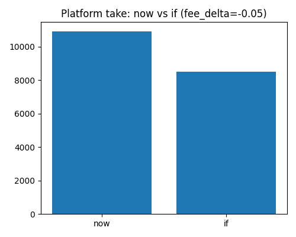
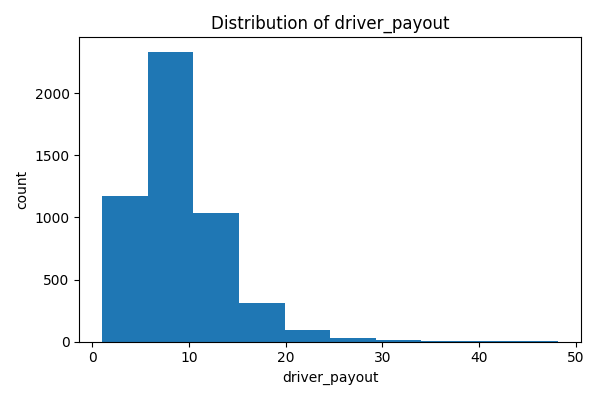

# Uber Eats Driver Analytics

## 📌 Project Summary
Analyzed Uber Eats delivery and driver data using **SQL** and **Python** to compute key KPIs and simulate the impact of reducing platform fees by 5% on driver earnings and platform revenue.

---

## 🔑 KPI Summary

| KPI | Value |
|-----|-------|
| GMV | 112,342.51 |
| Total fare | 48,494.42 |
| Platform take | 10,925.06 |
| Driver earnings | 45,232.80 |
| Total tips | 7,391.83 |
| Total trips | 5,000 |
| Avg payout/trip | 9.05 |
| Avg earnings/hour | 34.64 |

---

## 🏷 Policy Simulation (-5% fee)

| Metric | Current | Simulated | Δ |
|--------|---------|-----------|---|
| Platform take | 10,925 | 8,500 | ▼ -2,425 |
| Driver earnings | 45,233 | 47,386 | ▲ +2,153 |

**Insight:** A 5% fee reduction increases driver earnings while reducing platform take.

---

## 👥 Top 5 Drivers (by earnings gain)

| driver_id | trips | current | simulated | Δ |
|-----------|-------|--------|-----------|---|
| D0164 | 32 | 352.11 | 370.78 | +18.67 |
| D0088 | 33 | 328.75 | 347.24 | +18.49 |
| D0041 | 32 | 309.52 | 327.49 | +17.97 |
| D0074 | 32 | 320.23 | 338.07 | +17.84 |
| D0118 | 34 | 324.70 | 342.28 | +17.58 |

[Full CSV](results/top10_drivers.csv)

---

## 📊 Visuals
  

---

## 🗂 Project Files
- `sql/` → Table creation & queries  
- `scripts/` → KPI & visualization Python scripts  
- `results/` → Output charts & CSVs  
- `data/` → Sample CSVs  

